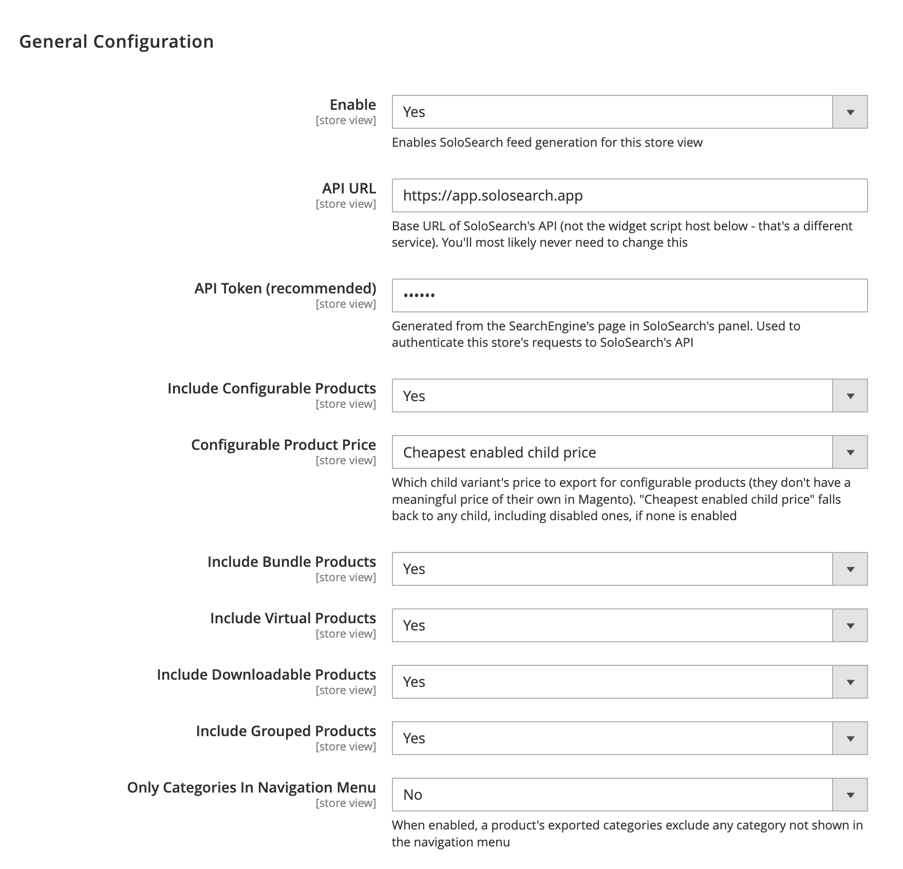
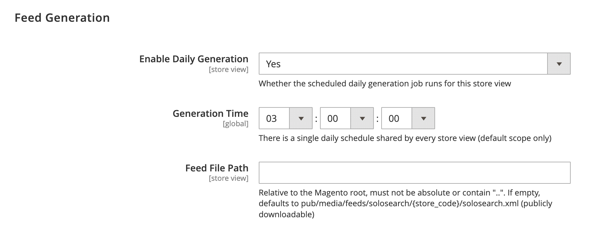
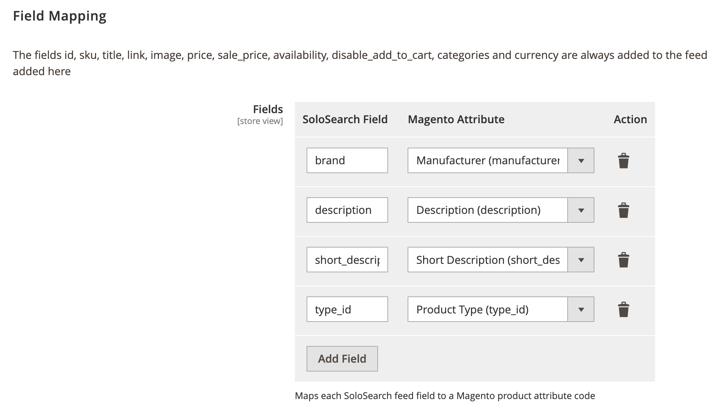
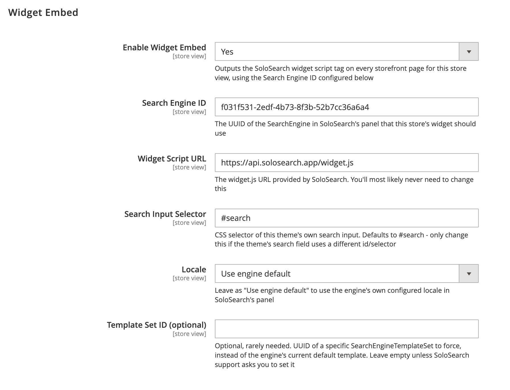

# SoloSearch Official Module

Magento 2 module for [SoloSearch](https://solosearch.app) — an instant search engine and management panel for ecommerce, built as an affordable alternative to costlier options like Doofinder.

SoloSearch indexes your product catalog and serves a fast, typo-tolerant search widget that drops into your storefront with a single `<script>` tag. Search behavior, ranking, boosts, filters, and the widget's own look and feel are all managed from SoloSearch's panel — no redeploys needed on the Magento side once this module is installed and configured.

- **Website:** [solosearch.app](https://solosearch.app)
- **Documentation:** [solosearch.app/docs](https://solosearch.app/docs)
- **Sign up:** [solosearch.app/panel/register](https://solosearch.app/panel/register)

## What this module does

- **Generates the product feed** SoloSearch indexes — a scheduled job (or an on-demand command) builds an XML feed from your catalog and writes it to a public path SoloSearch fetches.
- **Handles Magento-specific product logic** so the feed is accurate out of the box: configurable product pricing (cheapest child variant, with fallback rules), bundle pricing and discounts via Magento's own pricing framework, stock status (MSI-aware), category paths, and which products can't be added to cart directly from a search result (configurable/grouped/bundle products, or anything with required custom options).
- **Embeds the SoloSearch widget** on your storefront — no manual `<script>` tag editing required, it's all driven by the module's configuration.
- **Wires up add-to-cart** from search results, so a product card's "add to cart" button actually adds to the Magento cart and refreshes the mini-cart.
- **Notifies SoloSearch after every feed generation**, asking it to re-fetch and reindex immediately instead of waiting for its own schedule.

## Requirements

- PHP 8.1, 8.2, or 8.3
- Magento 2 (Open Source or Commerce)

## Installation

### Composer (recommended)

```bash
composer require bydn/module-solosearch
bin/magento module:enable Bydn_SoloSearch
bin/magento setup:upgrade
```

### Manual

Copy (or symlink) the module into your Magento installation under `app/code/Bydn/SoloSearch`, then:

```bash
bin/magento module:enable Bydn_SoloSearch
bin/magento setup:upgrade
```

## Configuration

Configuration lives under **Stores → Configuration → SoloSearch**, split into four sections.

### General Configuration

Enable/disable the module, the API URL and Token used to talk to SoloSearch, and which Magento product types to include in the feed.



### Feed Generation

Controls the scheduled daily feed generation (time and on/off) and where the feed file is written.



### Field Mapping

Maps additional Magento product attributes to SoloSearch feed fields, on top of the structural fields (`id`, `sku`, `title`, `link`, `image`, `price`, `sale_price`, `availability`, `disable_add_to_cart`, `categories`, `currency`) that are always included automatically.



### Widget Embed

Enables the SoloSearch widget on the storefront and configures which search engine it connects to, without touching any theme template.



## Console commands

```bash
# Generate the feed manually - for every enabled store view, or a single one
bin/magento solosearch:feed:generate
bin/magento solosearch:feed:generate --store=<code|id>
```

## Support

Questions or issues: [hello@solosearch.app](mailto:hello@solosearch.app)

## License

Proprietary.
